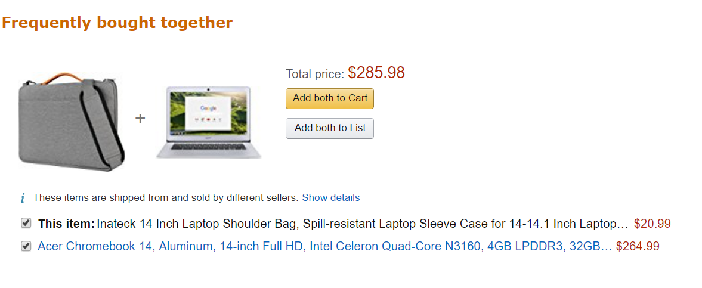
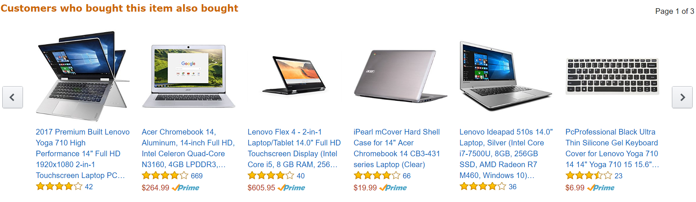
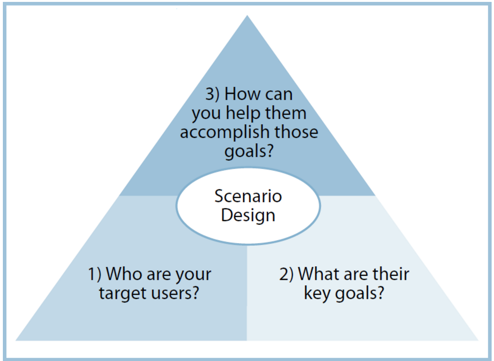

Every company that has online presence has been investing in `recommender algorithm`. Some developed their own and other companies acquired technology. Website [TechCrunch](https://techcrunch.com/tag/recommendations/) has numerous articles that shed light on this subject.

One company I would like to focus on is `Amazon`, it has to be noted that they have very nice `recommender algorithm`, that suggests items other people bought together but sometimes it misses the mark. In my case, I was trying to buy `Chromebook case` for my kid. Following image show what Amazon has suggested. It would be great if it showed other accessories similar to `wireless mouse` or a `keyboard`. When a person wants to buy `Chromebook case`, that means he has a `Chromebook` and wants to buy a `case`. The second image shows `keyboard` option but is after `Chromebooks`. It is minor compared to the right suggestions site offers, as I have a Premier membership, I guess it is worth mentioning.

Focusing on above primid.

1. Who are the target users?

A: Customers who want to buy items online.

2. What are the key goals?

A: Goal to understand customers better and give them options to make better choices.

3. How can you help them to accomplish those goals?

A: I would provide some more options, at least five more. Customers who bought items not just upstream `Case + Chromebook.'

But also downstream, similar to following. Including multiple brands.

- Case + Wireless Mouse
- Case + Mousepad
- Case + Keyboard

On a side note, I have worked on Latent Dirichlet allocation(LCA) and Collaborative Topic Modeling (CTM), both are very interesting models. They both provide different results for the same set of documents. In both cases, we need to have predefined `topic sets` to assign topics identified from the documents. CTM model takes longer to run compared to LCA.

